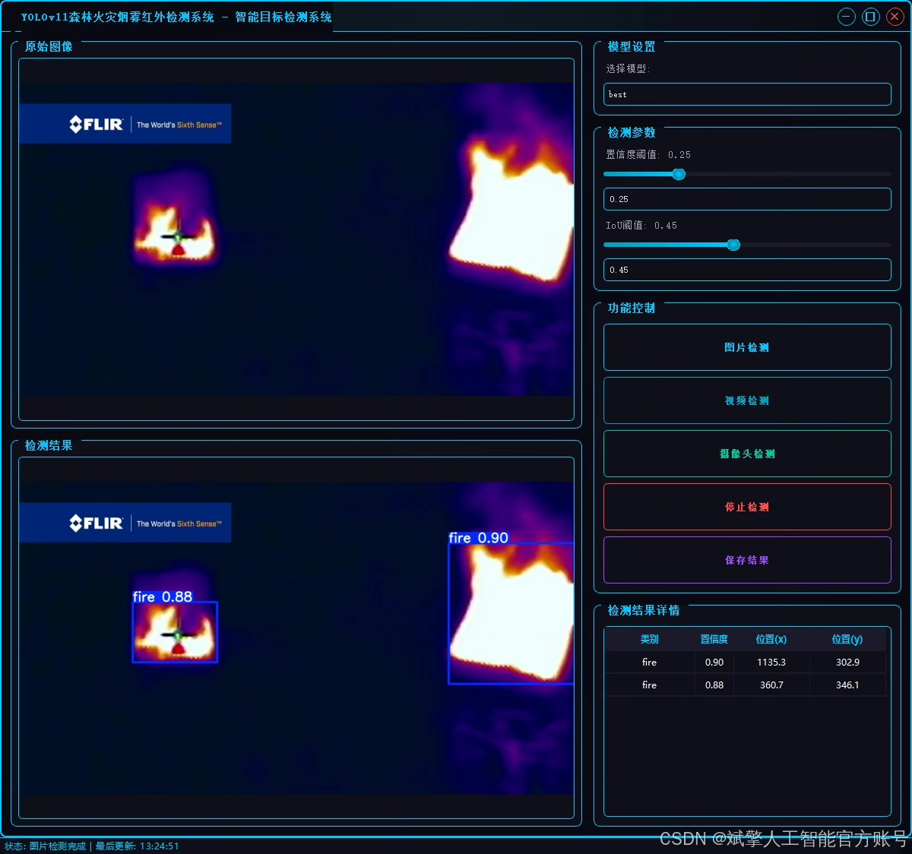
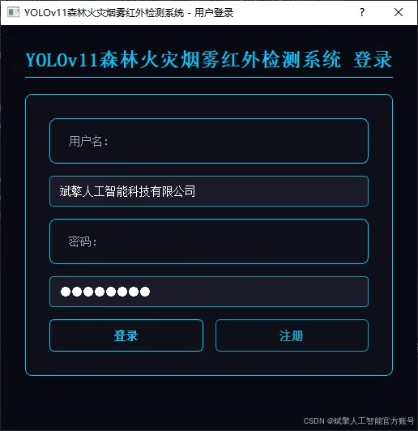
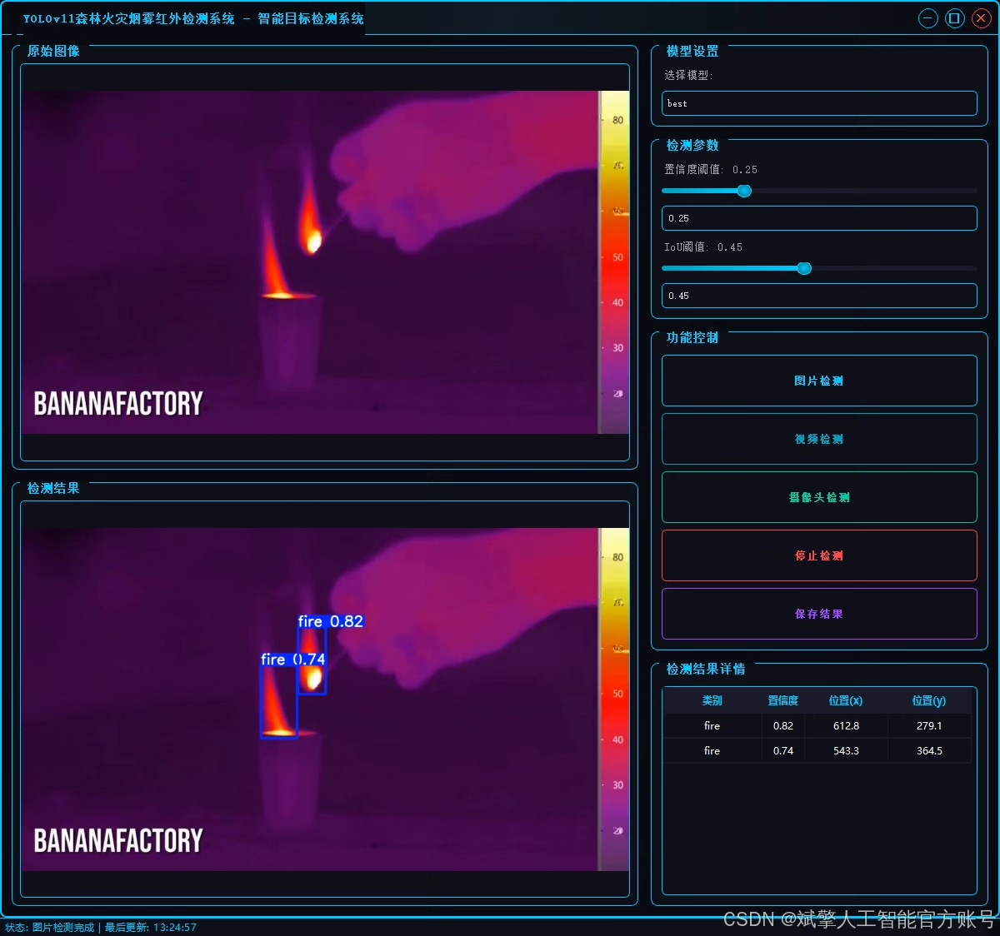
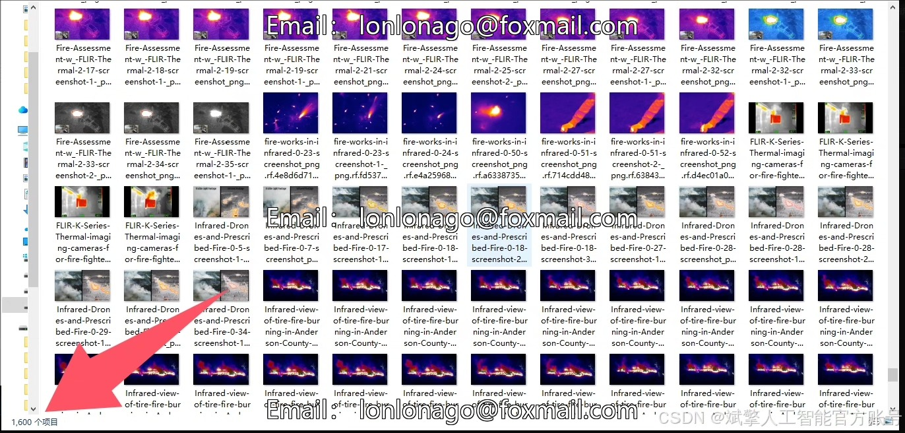
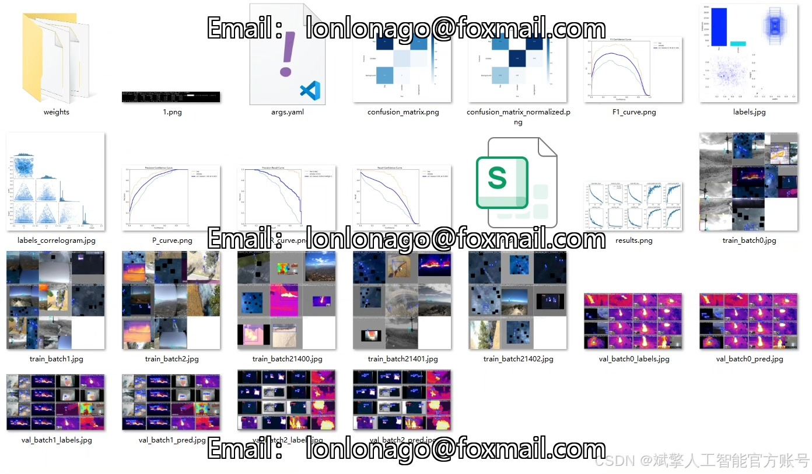
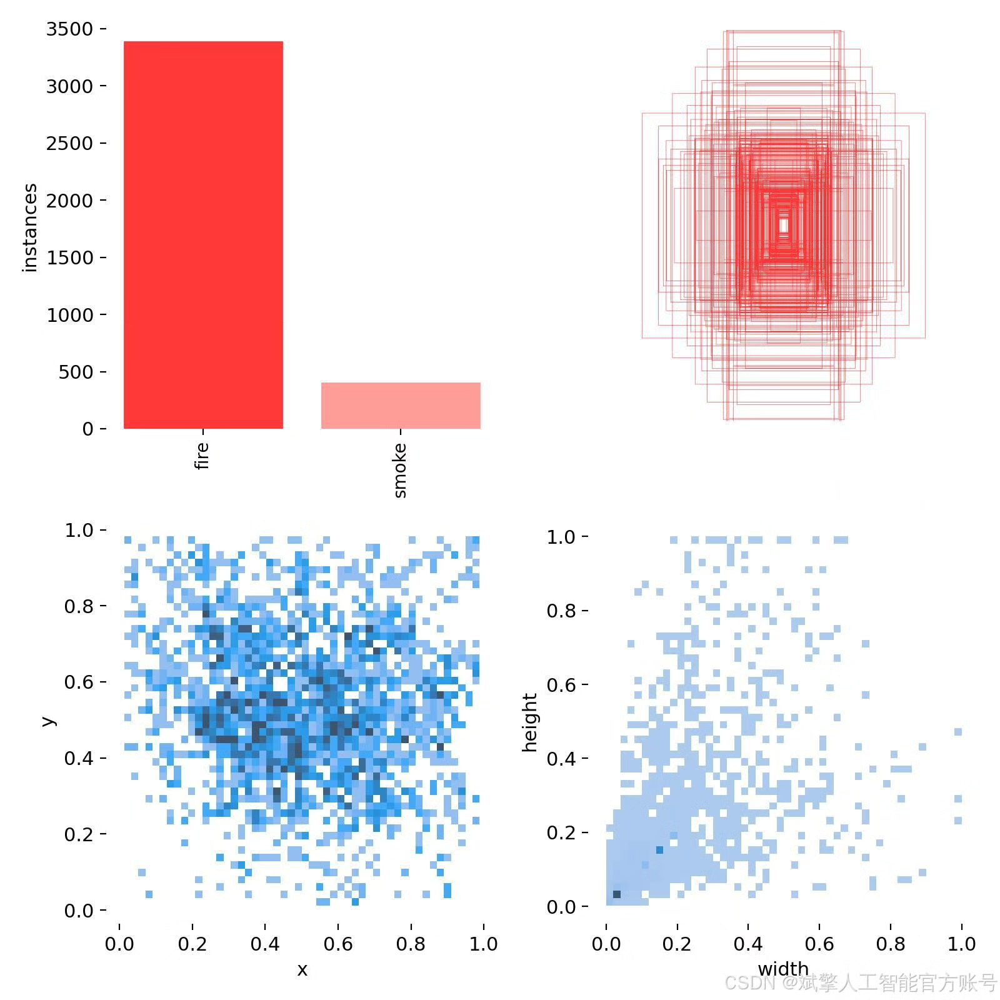
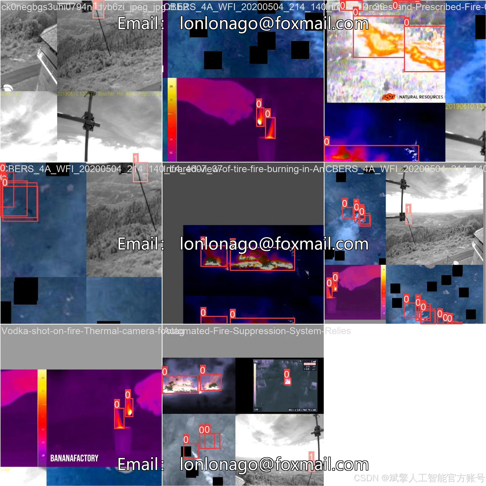
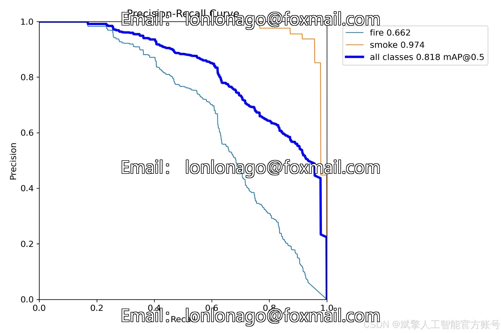
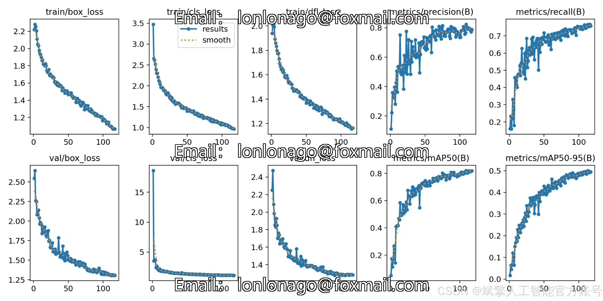

# YOLOv11 Forest Fire Detection System

## Body

YOLOv11 Forest Fire Detection System Based on Deep Learning YOLOv11's Infrared Forest Fire Flame and Smoke Detection System (YOLOv11+YOLO dataset + UI interface + login registration interface + Python project source code + model)

In response to the demand for early detection of forest fires, this study proposes a system based on deep learning YOLOv11 for infrared forest fire flame and smoke detection. This system leverages the efficient target detection capability of YOLOv11 algorithm, combined with the characteristics of infrared images, to achieve precise recognition of flames and smoke. The dataset includes 2000 labeled images (1600 training set, 200 validation set, 200 test set), covering diverse fire scenes. The system integrates a user-friendly UI interface, supporting login registration functions. Experiments show that the system achieves high detection accuracy and real-time performance on the test set, providing an intelligent solution for forest fire prevention and control.

Dataset:
nc: 2
names: ['fire', 'smoke'],
dataset quantity: training set 1600, validation set 200, test set 200

✅ User login registration: Supports password detection and security verification.
✅ Three detection modes: Based on the YOLOv11 model, supports image, video, and real-time camera three types of detection, accurately identifying targets.
✅ Dual-screen comparison: Display original images and detection results on the same screen.
✅ Data visualization: Real-time table displaying the category, confidence, and coordinates of detected targets.
✅ Intelligent parameter adjustment: Offers a confidence slide bar, dynamically optimizing detection accuracy to meet different scene needs.
✅ Sci-fi style interactive interface: Dark theme paired with dynamic light effects, reducing visual fatigue and improving operational experience.

## Images

## Payment

Here is a pay link on Stripe ( https://buy.stripe.com/3cs8yP7sY87d0vu9AB ). Please contact me lonlonago@foxmail.com after funding $89, and I will send you a complete data files , thank you!

